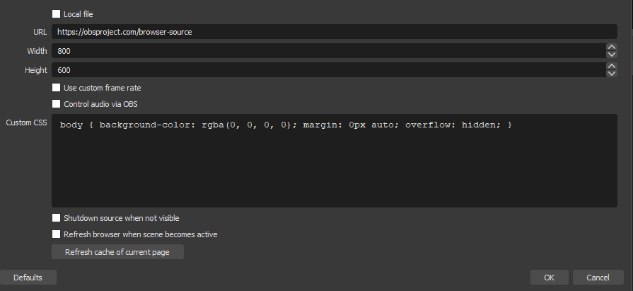

# Scoreboard

Display a real time scoreboard on a web page from a Google Sheet. Pipe the browser into a [chroma key system](https://en.wikipedia.org/wiki/Chroma_key) to have the scoreboard overlay on other video sources. Here is the scoreboard combined with a background, scrolling headline along the top and branding on the bottom:

The raw output of this app has a "HIGH SCORES:" title, and then a tabular, enumerated output of players and their points and [looks like this](images/raw.output.png).

This was originally created to keep track of points during robot battles run by [Vegas Combat Robtics Club](https://vegascombatrobotics.com/) and [Synshop](https://synhop.org).

## Prerequisites

1. Webserver with PHP
   - Repl.it can also be used. Click Here: 
2. Google Sheet that is publicly shared

## Install 

1. Create a google doc modeled after this one: [Link to google sheet](https://docs.google.com/spreadsheets/d/1eQHR3-sW3VcTmIQn3ybS6PctSjtD78Oip5J2cyl6Xdw/edit#gid=0). You can also see [sample.csv](./sample.csv) for a starter.  The net result should be a spreadhseet in Google Docs with a worksheet called `Sheet1`. Column A has a header and then a list of contestants.  Column B has a header and then a points for each contestant. Other columns and worksheets can be added, but will be ignored.
2. Make sure it's shared so the public can view it
3. Get the ID from the URL of sheet (eg `1eQHR3-sW3VcTmIQn3ybS6PctSjtD78Oip5J2cyl6Xdw`)
4. Clone this repo.  If you're putting it directly in the web directory, be sure the sensitive `.git` files are **not** web readable.
   - you can also run this directly from repl.it by following the links above. The remaining steps will still need done there
5. Copy `config.dist.php` to `config.php`. Update the `$sheet_id` and `$sheet_name` and `$refreshRate` as needed. The refresh rate is in seconds.
6. Open a browser to your web server and follow Using in OBS below.

## How it works

The HTML page is loaded as empty.  It then calls `loadData()` which makes an AJAX call to `sheet.json.php` which downloads the Google Sheet and returns up a cooked JSON object. The use of this PHP script avoids any [CORS](https://en.wikipedia.org/wiki/CORS) issues with accessing the JSON on a 3rd party site. 

The scripts in `players.js` then loops over the JSON and outputs a `
` per player and score. `

The page will refresh every N seconds based on the value of `$refreshRate` by repeatedly calling `loadData()`.

If your score is  `0` you do not show on the board. Any player with more than `0`, will show.  The top five contestants show in a larger font and different color.

## Using in OBS

This is meant to be used in [OBS as a Browser Source](https://obsproject.com/wiki/Sources-Guide#browser-source). It leverages the green background to use it as a chroma key to overlay on other layers. To add a Browser Source to your scene:

1. Click the plus button as shown below:

   

2. Name this Source whatever you like and hit OK:

   

3. Modify the Properties screen as follows:

   
   - Change the URL field to the location and name of your Scoreboard install
     - This could be either your website, or in the case of using a Repl, you could use their link like this: "https://googledocsscoreboard.themightypong.repl.co/"
   - change the resolution to 1920x1080
   - remove ALL css from the box in the middle
   - click OK to save.

## Thanks To the Following Contributors
Thanks to [mrjones](github.com/mrjones-plip/), JimF-YYC and Tydence!

Inspired by Merlin Schäfer's Article on towardsdatascience.com 
"Read Data from Google Sheets into Pandas without the Google Sheets API"
https://towardsdatascience.com/read-data-from-google-sheets-into-pandas-without-the-google-sheets-api-5c468536550
